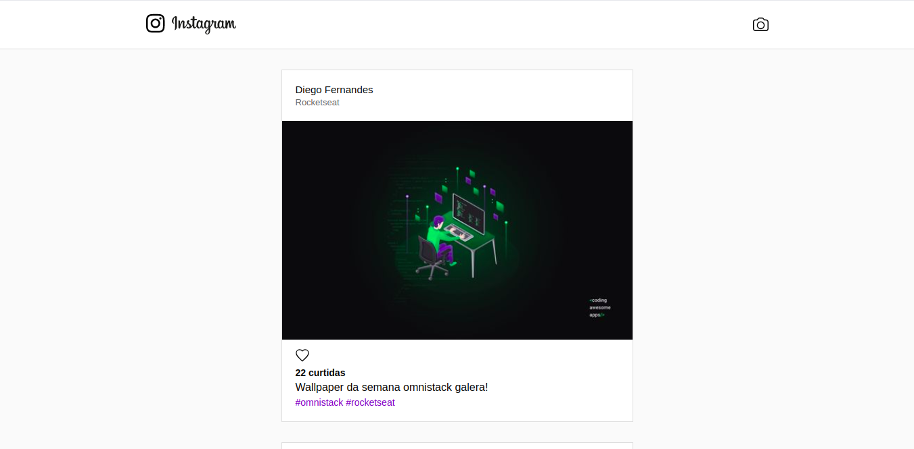
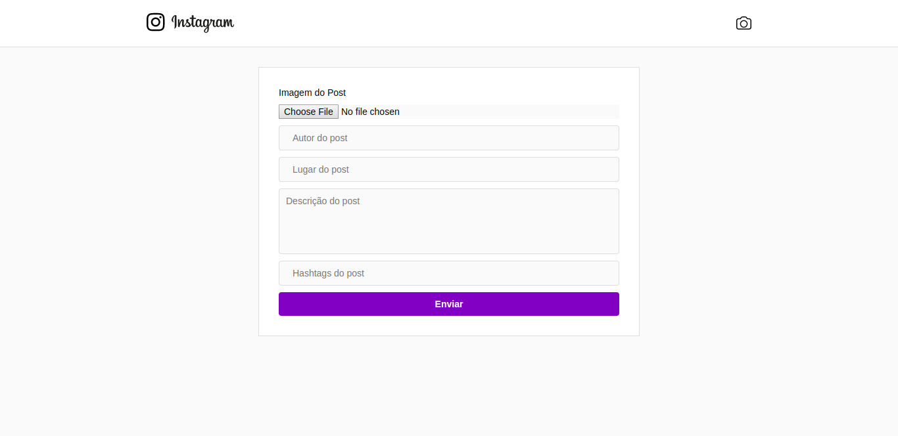
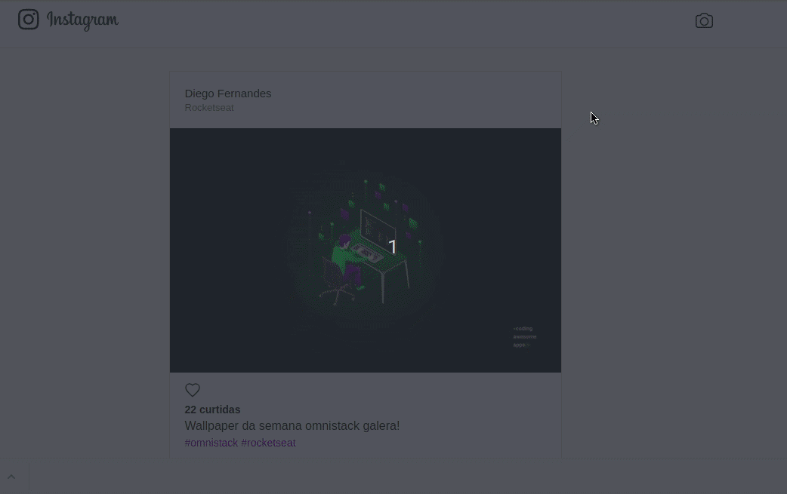
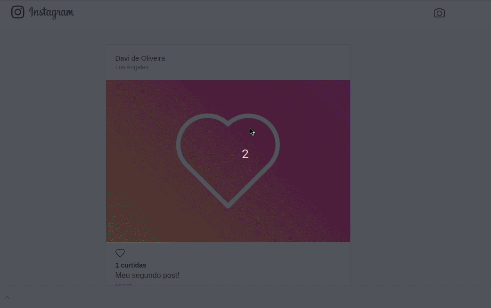
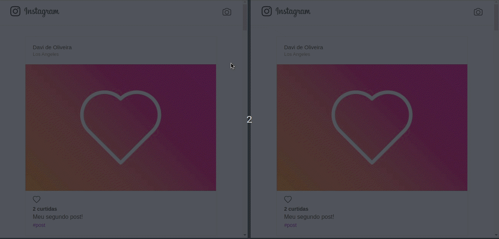

<p align="center">

</p>
<h3 align="center">Simple Instagram clone </h3>

---

## :notebook: About the project:

A simple Instagram clone, with the features of like, create a new post, and list all posts! All in real-time, using WebSockets.

---

## :book: What i learned ?
1. The concept of API.
2. MVC architecture.
3. WebSockets.
4. Resizing images.
5. SPA - Single Page Applications
6. React Hooks
7. MongoDB Atlas
8. Flex Layout
9. :muscle: and a lot of other things.

---

## :hammer: Built with technologies:

- JS
- React
- Node.JS
- Express
- MongoDB
- SocketIO

---

## :rocket: Run this project:

To run this project on your machine, do:

Clone this repository

```bash
$ git clone https://github.com/davioliveira-dev/instagram-clone.git
``` 

Enter the <strong> "backend" </strong> folder and back up the project with <a href="">Yarn or NPM </a> , with the commands:

With Yarn
```bash
$ yarn install && yarn start
```

With NPM
```bash
$ npm install && npm start
```
---

<b> IMPORTANT <b>
I used MongoDB Atlas, if you want to get my MongoDB URL send me an email -> davioliveira.java@gmail.com !

---

Enter the <strong> "web" </strong> folder and run the project with <a href=""> Yarn or NPM </a>, with the commands:

With Yarn
```bash
$ yarn install && yarn start
```

With NPM
```bash
$ npm install && npm start
```

<b style="font-size:25px;"> And Finally: </b>

Open on your browser the address <a>```http://localhost:3000```</a>

---

## :beginner: Examples

<b style="font-size:20px;">Showing application routes</b>
<h3 align="center">
  
</h3>
<h3 align="center">
  
</h3>

<b style="font-size:20px;">Showing the feature to create a post and like it, in real time.</b>
<h3 align="center">
  
</h3>


<b style="font-size:20px;">Showing the feature of giving likes in real time with the changes saved in the database.</b>
<h3 align="center">
  
</h3>

<b style="font-size:20px;">Showing the feature of creating a post and liking it in real time, with two users at the same time! </b>
<h3 align="center">
  
</h3>

<b style="font-size:20px;"> NEW FEATURE !! :rocket: Now you can create comments!</b>
<h3 align="center">
  
</h3>

---
## :blue_book: Contributing

1. Fork it (<https://github.com/davioliveira-dev/instagram-clone/fork>)
2. Create your feature branch (`git checkout -b feature/fooBar`)
3. Commit your changes (`git commit -am 'Add some fooBar'`)
4. Push to the branch (`git push origin feature/fooBar`)
5. Create a new Pull Request

---

## :blue_heart: About me
<a alt="Davi Oliveira - NPM" href="https://www.npmjs.com/~davioliveira-dev">
  
</a>
<br>
<a alt="Davi Oliveira - LinkedIn" href="https://www.linkedin.com/in/davioliveira-dev">
    
</a>
<br>
<a alt="Davi Oliveira - Twitter" href="https://www.twitter.com/davioliveiradev">
    
</a>
